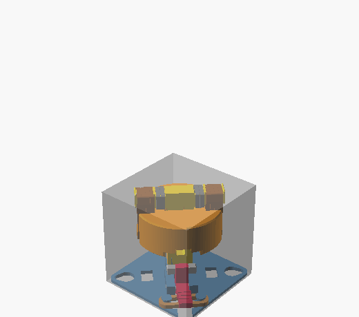
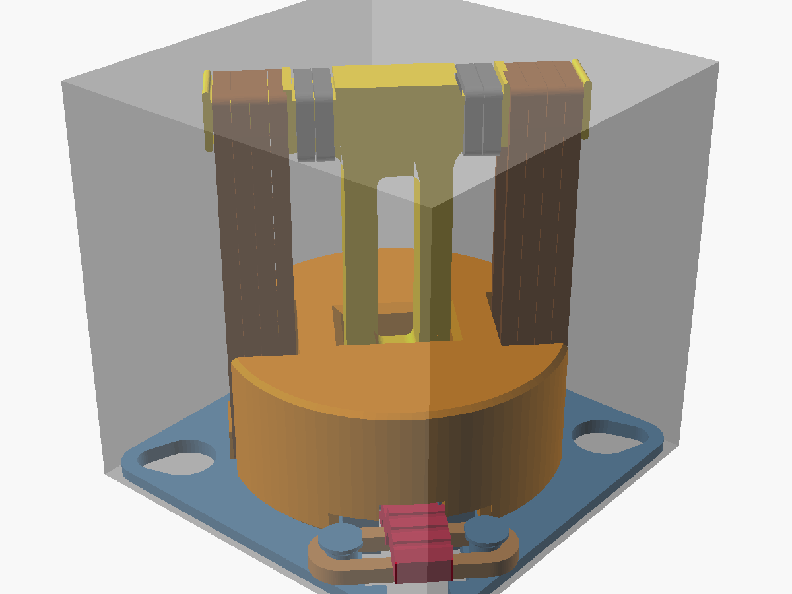
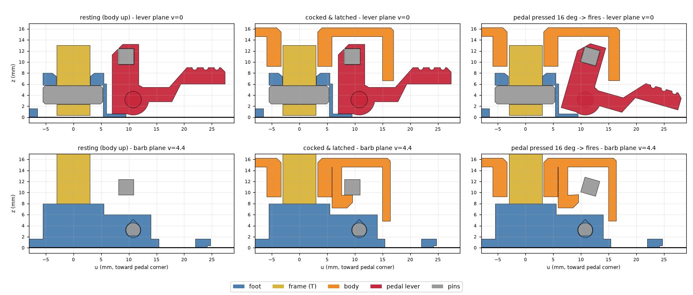
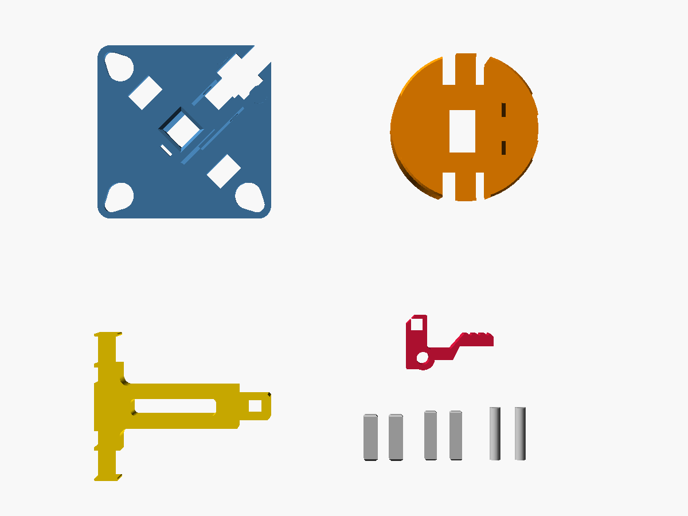

# HOPPER-A — rubber-band jumping toy (42 mm cube, PLA + rubber bands only)

A 3D-printable jumping toy for the **Bambu Lab A1 mini**. It's made from PLA and standard **#8 rubber bands** and nothing else: no screws, springs or glue.
The whole toy, bands included, fits inside a **42 × 42 × 42 mm cube** (measured: 41.7 × 41.7 × 41.6 mm).

| | 2 bands (1 per side) | **4 bands (2 per side) — recommended** | 6 bands (3 per side) — limit |
|---|---|---|---|
| predicted jump (nominal) | 3.0 ft (0.9 m) | **5.6 ft (1.7 m)** | 8.0 ft (2.4 m) |
| realistic range (soft … stiff bands) | 1.8 – 4.4 ft | **3.5 – 8.1 ft** | 5.1 – 11.4 ft |
| force to cock (push the body down) | 25 N (2.6 kgf) | 50 N (5.2 kgf) | 76 N (7.7 kgf) |
| pedal force to fire | ≈3 N | ≈5 N | ≈7 N |
| lowest static safety factor on the PLA | 6.2 | **3.1** | 2.1 |
| lowest impact safety factor (pessimistic) | 3.5 | **2.5** | 2.0 |

**Goal statement.** With only the printed parts and **4 × #8 rubber bands** (each looped double), the toy jumps
**about 5½ ft (1.7 m) straight up**. Every PLA part keeps a **safety factor of 3 or more** when cocked with those
4 bands, and still **2 or more at 6 bands**. The full numbers are in [docs/PERFORMANCE.md](docs/PERFORMANCE.md).
The jump heights come from a physics model. Real rubber bands vary a lot, so expect your toy to land somewhere in the range column.

Also needed: **1 more #8 band** for the trigger return spring and **2 more** for the crossbar bumpers.
That's **7 × #8 bands** in total for the recommended build.

## How it works

* **Foot** (blue): the base plate. It holds the central boss and the pivot block.
* **Frame** (gold): a "T" made of a stem and a crossbar. It's printed lying flat, so every tensile load runs along the filament. It pins into the foot from underneath.
* **Body** (orange): a 7.3 g puck that slides on the stem. Its mass is tuned to match the 7.1 g foot side, because a 1:1 split maximises jump height for a given amount of band energy.
* **Bands**: they loop over the crossbar ends and under pegs at the bottom of the body. Pushing the body *down* stretches them to about 3.9× their length.
* **Latch**: a pedal lever sits in the foot. Its steel-grey **sear pin** hooks over two barbs that hang inside the body.
  * **Cocking:** push the body down. The barbs cam the pin aside and it clicks in (18.6 mm stroke).
  * **Firing:** tap the **corner pedal down**. After about 13° of rotation (≈3 mm of pedal travel) the pin slips off the barbs. The body shoots up at about 12 m/s, hits the rubber-cushioned crossbar, and yanks the whole toy off the table.
  * **Why the pedal stays out of the way:**
    * It sits at the foot corner, outside the body's path.
    * You press it *down*, so the toy can't be pushed sideways across the table.
    * After release the lever can keep swinging for another 45°+. A finger still resting on the pedal therefore can't hold the foot down. The foot just pulls the pedal out from under the finger.
  * **Return spring:** a doubled #8 band stretched between two pegs like a bow-string, under the pedal arm.

## Files

| file | what |
|---|---|
| `hopper.scad` | The fully parametric model. Open it in OpenSCAD and use the **Customizer** `view` drop-down to switch between the views below. |
| `stl/hopper_plate.3mf` | **All 10 parts laid out for the A1 mini plate, as separate objects.** Open it directly in Bambu Studio. |
| `stl/hopper_*.stl` | One STL per part, already in print orientation. `hopper_plate.stl` is the whole plate as a single mesh. |
| `docs/PERFORMANCE.md` | Generated report: stretch, forces, energy, jump height, trigger force, and a safety factor for every load path. |
| `docs/BUILD.md` | Printing, assembly, use and tuning. |
| `tools/` | Checks and generators (see below). |

### Views in `hopper.scad` (Customizer → View → `view`)

| `view` | shows |
|---|---|
| `assembled` | resting toy inside the transparent 42 mm envelope cube (default) |
| `cocked` | body pulled down and latched |
| `firing` | pedal pressed and sear released |
| `exploded` | assembly pulled apart vertically |
| `section` | cocked toy cut on the lever mid-plane |
| `animate` | cock → fire → jump; use View ▸ Animate (FPS 15, Steps 120) |
| `print` | every part on the 180 × 180 A1 mini bed |
| `part` | one part (choose it in `part`) in print orientation, for STL export |

Other toggles: `show_bands`, `show_envelope`, `show_bed`, `bands_per_side` (1–3, visual only).
Print fits (`fit_slide`, `fit_rot`, `fit_pin`) and latch tuning (`e_bias`, `barb_tilt`, `overtravel`) are Customizer parameters too.

## Verification (`tools/build_all.sh`)

The tools rebuild and re-check everything after any edit:

* **`check_geometry.py`** runs exact mesh booleans (manifold3d) on every part and checks:
  * every part is a closed solid
  * no two parts overlap at rest, latched or bottomed out
  * the latch cocks correctly at every body height, and the lever deflection needed on the way down is recorded
  * the sear releases at 13° of rotation
  * the lever swings freely for at least 45° after release
  * the assembled toy, bands included, fits inside 42 mm
  * the body's centre of mass sits on the stem axis (0.13 mm off)
  * it also records each part's mass
* **`hopper_calc.py`** runs the neo-Hookean rubber model, the launch and drag model, the trigger and friction model, and the stress checks. It writes `docs/PERFORMANCE.md`.
* **`section_plot.py`** draws the latch cross-sections from the real meshes.
* **`export_stl.py`** writes the STLs and the 3MF, then checks that the plate holds 10 separate bodies, all on the bed and all inside 180 mm.

Requirements: `openscad` (2021.01 or newer), `xvfb-run` for images, and Python 3 with `trimesh manifold3d shapely scipy matplotlib lxml`.
